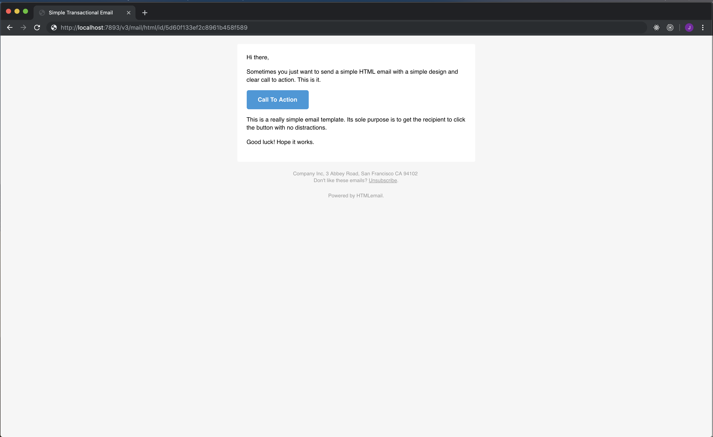
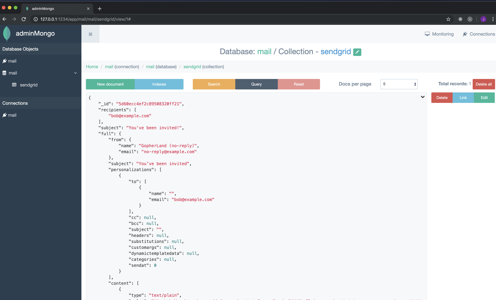

# Go Local Mail

Handy little email interceptor, written in Go and using Mongo for storage (Currently only supporting Sendgrid V3 API)

## Why go-local-mail?

Because having to setup an account and give out keys to send email while developing sucks!

When Developing most of the time all you need is:
- A way to test that emails are being sent from our app
- Tokens/urls they generate
- Validate both text and html is as expected
- Validate the email has been received
- Store emails locally
- Test the email component of our app

## Features

## Installation
clone the repo and `docker-compose up` to have local mail and the `mongo` document store running.

## API

### SendGrid V3 API

Support is build in for the Sendgrid v3 Api and uses the [models](https://github.com/sendgrid/sendgrid-go/blob/d1c72cf7d640fb33478848959485bb0cf916809b/helpers/mail/mail_v3.go) they provide.

All unknown data will be stored as `unused`.

#### Send `/v3/mail/send`
Mocks the api endpoint used by Sendgrid, processes and stores data

Prints to stdout:
- all recipients for the received email
- email subject
- URL for user interaction if one has been received
- link to view text version
- link to view html version
- ID for the stored email


**Example** output from received request
```
2019/08/24 17:41:31 POST /v3/mail/send HTTP/1.1
Host: localhost:7893
Connection: close
Accept: application/json
Authorization: Bearer sometoken
Connection: close
Content-Length: 27121
Content-Type: application/json
User-Agent: sendgrid/5.2.3;nodejs

Recipients: [bob@example.com] 
Subject: Welcome Aboard Bob
URL: http://localhost:8080/signup?verify=6c243fc6-4464-46d1-ac20-a6bf2a8d0edc
HTML: http://localhost:7893/v3/mail/html/id/5d60f133ef2c8961b458f589 
TXT: http://localhost:7893/v3/mail/text/id/5d60f133ef2c8961b458f589 
ID: 5d60f133ef2c8961b458f589
```

#### All `/v3/mail/all`
Returns all mail received and stored by the Sendgrid endpoint.

**Example** Stored email JSON representation
```json
[
    {
        "_id": "5d60ecc4ef2c89508320ff21",
        "recipients": [
            "bob@example.com"
        ],
        "subject": "Welcome Aboard Bob",
        "full": {
            ...
            ...
        },
        "createdAt": "2019-08-24T07:52:36.283Z"
    },
    {
        "_id": "5d60ee01ef2c895987da8f59",
        "recipients": [
            "bill@example.com"
        ],
        "subject": "Welcome Aboard Bill",
        "full": {
            ...
            ...
        },
        "createdAt": "2019-08-24T07:57:53.490Z"
    }
]

```

#### GET `/v3/mail/html/id/`
Returns the html content of the email - useful for viewing html formatting of the email in the browser.

**Example** Retrieve html content of email

URL: `http://localhost:7893/v3/mail/html/id/5d60f133ef2c8961b458f589`



#### GET `/v3/mail/text/id/`

Returns the text content of the email - useful for checking the email content in the terminal
```
$ curl http://localhost:7893/v3/mail/text/id/5d60f133ef2c8961b458f589
Hi, 

Welcome Aboard Bob.

YOUR ACCOUNT
http://localhost:8080/signup?verify=6c243fc6-4464-46d1-ac20-a6bf2a8d0edc

Sent by GopherLand
-
```

#### GET `/v3/mail/text/link/id/`
Returns the URL if it exists for an email given an ID - useful for pulling links out of emails

```
$ curl http://localhost:7893/v3/mail/text/link/id/5d60f133ef2c8961b458f589
http://localhost:8080/signup?verify=6c243fc6-4464-46d1-ac20-a6bf2a8d0edc
```

## Local Data Storage
Stores the data locally for development.

Uses Mongo and [admin-mongo](https://github.com/mrvautin/adminMongo) (<--buy a coffee) to view and edit stored emails in the browser.

Navigate to http://localhost:1234/app/localmail to view entries


